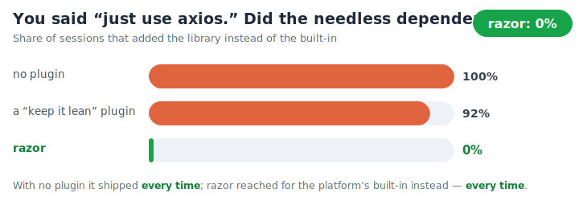
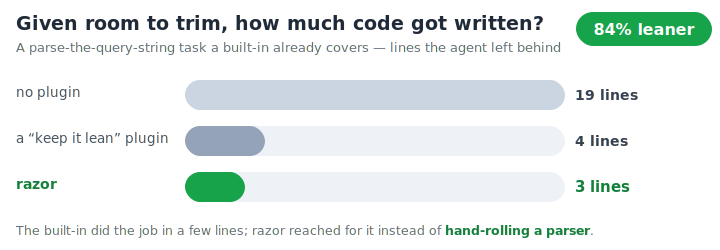

<div align="center">
  <picture>
    <source media="(prefers-color-scheme: dark)" srcset="assets/logo-dark.svg" />
    
  </picture>
  <h1>razor</h1>
  <p><strong>Stops Claude from over-building — no unnecessary dependencies, no file sprawl, no code "for later".</strong></p>
</div>

---

## What is this?

AI assistants love to add things. Ask for one small feature and you might get a new library installed, five helper files, and an abstraction layer for a future that never comes — all of it stuff you now have to understand, maintain, and eventually delete.

razor teaches Claude a simple habit: **don't build what isn't needed, reuse what's already there, prefer what's already installed.** And it backs the habit with real checks — when Claude reaches for a new dependency (whether as an install command, an `import` line, or a direct edit to the manifest), starts spawning files, or keeps searching instead of shipping, razor makes it stop and reconsider once. If Claude still thinks it's right, it goes ahead. A speed bump for second thoughts, never a wall.

It's built for real engineering sessions — the long kind, where one casual "just add a library" quietly becomes a stack you maintain forever.

## Why you'd want it

- **Leaner projects.** Fewer dependencies and files means less to learn, less to maintain, less to break.
- **It acts, not just advises.** "Reuse first" is enforced in the tool layer, not just suggested in a prompt Claude can forget.
- **Never blocks you.** Every nudge fires once and the retry always goes through. You stay in control.
- **One switch.** `/razor off` turns it off for the session, `/razor on` back on. No dials to fiddle with.

## Install

Inside Claude Code, run:

```
/plugin marketplace add V-Songbird/foundry
/plugin install razor
```

It's active from your next session — nothing to configure.

## Benchmarks

We put razor up against plain Claude Code and a popular "keep it lean" plugin on real engineering work — full agent sessions that read, write, and run code, not a single generated reply. Same coding jobs, three setups; we measured the code and the bill.

<p align="center"></p>

**Say "just use axios" and razor quietly reaches for what's already built in.** That throwaway line ships a real dependency you now have to keep updated and secure. With no plugin it shipped every time; even a "keep it lean" plugin let almost all of them through. razor never did — on the small model and the big one alike.

<p align="center"></p>

**That "never" matters more than it sounds.** Open-source registries have already blocked over 1.2 million malicious packages, and new ones arrive faster every year. Every dependency razor talks Claude out of is one fewer door into that pool.

<p align="center"></p>

**And where there's bloat to cut, razor cuts it.** Hand it a job a built-in already covers and no plugin will hand-roll a 19-line parser; razor reaches for the built-in and writes three. It writes less than doing nothing — and never more.

### The full picture

Every job, every setup — the big wins, the ties, and the one row where doing nothing wins, because a scoreboard that only shows wins isn't worth much. Fewest lines per row in **bold**.

| Coding task | no plugin | "keep it lean" | razor |
| --- | --- | --- | --- |
| Parse a query string | 19 | 4 | **3** |
| Read a `.env` file | 24 | 22 | **18** |
| Add a command to a CLI | 16 | 14 | **11** |
| "Just use axios" and fetch | 4 | 4 | **2** |
| Reuse-or-write a helper | 52 | **46** | **46** |
| A one-line HTTP GET | **2** | **2** | **2** |
| Generate a unique id | **1** | 3 | 3 |
| **Average across the suite** | 15 | 13 | **12** |

**Leaner, and never careless.** razor wrote the fewest lines on average — and still passed the most jobs correctly of any setup, at about the same cost as running no plugin at all. Being lean is only worth something if the code still works, and razor's did.

> [!NOTE]
> You'll see lean-code tools headline much bigger cuts — 50%, even 90%. Those come from jobs with a lot to trim: a hand-built interface widget that one native element replaces. razor's benchmark measures already-tight backend code, where an honest cut is smaller — there's simply less bloat to remove. That's why a few rows above tie, or even match doing nothing: there was nothing to cut. The discipline is the same — point it at a real over-build and it saves a lot, point it at already-lean code and it just holds the line. It never pads, and it never ships the needless dependency.

*How we tested: the same coding jobs, three setups, several runs each in fresh throwaway workspaces — full agent sessions, never a single generated reply — with the real cost read straight from the API. Numbers move a few percent between runs, and hold on the bigger model too. Reproduce it yourself — see [benchmarks/](benchmarks/).*

## Under the hood

If you're curious, it's all a handful of gentle, one-time nudges that fire as Claude works — not just a reminder at the start — never a nag, never a wall, and all there to read in the plugin's files. Pairs naturally with [hush](https://github.com/V-Songbird/hush): razor keeps the code lean, hush keeps the noise down — and measured together, they add no overhead to each other.

## Settings

Most people never touch these. razor asks for them when you enable it (and they can be changed anytime in the plugin's configuration) — the environment variables below do the same thing and take precedence when set:

| Variable | What it does |
| --- | --- |
| `RAZOR_DISABLE=1` | Turns everything off |
| `RAZOR_DEP_GUARD=off` | Stops the new-dependency nudge for install commands |
| `RAZOR_IMPORT_GUARD=off` | Stops the new-dependency nudge for `import`/`require` lines |
| `RAZOR_MANIFEST_GUARD=off` | Stops the new-dependency nudge for direct edits to `package.json`/`requirements.txt` |
| `RAZOR_FILE_BUDGET=4` | New files allowed in one turn before it speaks up |
| `RAZOR_SEARCH_BUDGET=1` | Extra searches allowed after the code is written before it speaks up |
| `RAZOR_LEDGER=off` | Turns off the end-of-session "is all this needed?" check |

## License

MIT — see [LICENSE](./LICENSE).
