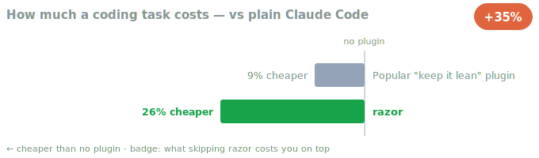
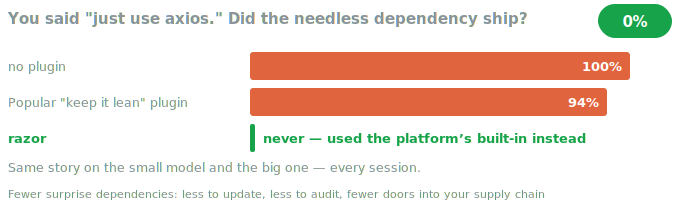
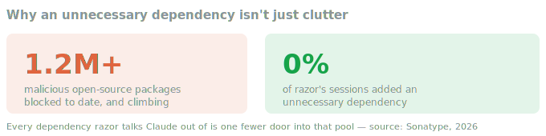

<div align="center">
  
  <h1>razor</h1>
  <p><strong>Stops Claude from over-building — no unnecessary dependencies, no file sprawl, no code "for later".</strong></p>
</div>

---

## What is this?

AI assistants love to add things. Ask for one small feature and you might get a new library installed, five helper files, and an abstraction layer for a future that never comes — all of it stuff you now have to understand, maintain, and eventually delete.

razor teaches Claude a simple habit: **don't build what isn't needed, reuse what's already there, prefer what's already installed.** And it backs the habit with real checks — when Claude reaches for a new dependency or starts spawning files, razor makes it stop and reconsider once. If Claude still thinks it's right, it goes ahead. A speed bump for second thoughts, never a wall.

## Why you'd want it

- **Leaner projects.** Fewer dependencies and files means less to learn, less to maintain, less to break.
- **It acts, not just advises.** "Reuse first" is enforced in the tool layer, not just suggested in a prompt Claude can forget.
- **Never blocks you.** Every nudge fires once and the retry always goes through. You stay in control.
- **One switch.** `/razor off` turns it off for the session, `/razor on` back on. No dials to fiddle with.

## Install

Inside Claude Code, run:

```
/plugin marketplace add V-Songbird/foundry
/plugin install razor
```

It's active from your next session — nothing to configure.

## Benchmarks

We put razor up against plain Claude Code and the popular "keep it lean" plugin on real engineering work — full agent sessions that read, write, and run code, not a single generated reply — same coding jobs, three setups, and measured the bill and the code.

<p align="center"></p>

**razor got the job done for about a quarter less — cheaper than running no plugin at all.** It writes the least code to get there, so there's less for you to read, less to review, and less that can quietly break later.

<p align="center"></p>

**Say "just use axios" and razor quietly reaches for what's already built in.** That throwaway line would otherwise ship a real dependency you now have to keep updated and secure — every time. With razor on, Claude used the platform's own tools instead and moved on.

<p align="center"></p>

**That "never" matters more than it sounds.** Open-source registries have already blocked over 1.2 million malicious packages, with new ones showing up faster every year. Every dependency razor talks Claude out of is one fewer door into that pool.

And it never cut a corner to do it: **every job still came out correct.**

> [!NOTE]
> On a task with nothing to trim — no stray dependency to reach for, no sprawl, a build that's already lean — razor and no plugin land in the same place. The wins above are real, they're just not universal.

*How we tested: we ran each setup on the same real coding tasks several times in a fresh, throwaway workspace — full agent sessions, never a single generated reply — and read the real cost straight from the API — no guesswork. Figures are averages on the smaller, cheaper model, and the headline results hold on the bigger one too.*

> [!TIP]
> razor never blocks you. If you genuinely want that library, just say so again and it steps aside — it's a nudge for second thoughts, not a wall.

*Curious whether this holds up?* You can reproduce it yourself — see [benchmarks/](benchmarks/).

## Under the hood

If you're curious, it's all a handful of gentle, one-time nudges — never a nag, never a wall — and it's all there to read in the plugin's files. Pairs naturally with [hush](https://github.com/V-Songbird/hush): razor cuts the code and the cost, hush cuts the noise — and measured together, they add no overhead to each other.

## Settings

Most people never touch these, but a few environment variables tune it or turn parts off:

| Variable | What it does |
| --- | --- |
| `RAZOR_DISABLE=1` | Turns everything off |
| `RAZOR_DEP_GUARD=off` | Stops the new-dependency nudge |
| `RAZOR_FILE_BUDGET=4` | New files allowed in one turn before it speaks up |
| `RAZOR_LEDGER=off` | Turns off the end-of-session "is all this needed?" check |

## License

MIT — see [LICENSE](./LICENSE).
