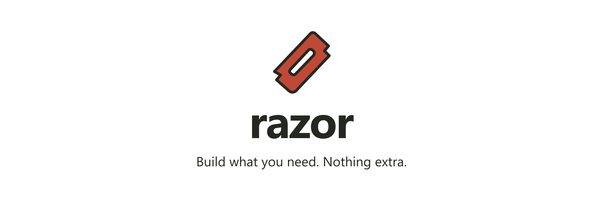

  <picture>
    <source media="(prefers-color-scheme: dark)" srcset="assets/banner-dark.png" />
    
  </picture>
  <h1>razor</h1>
  
<strong>Before adding code, ask whether the project already has what it needs.</strong>

<strong>Available on</strong>

  &emsp;&emsp; 
  <a href="https://github.com/V-Songbird/razor/tree/Codex">Codex</a>&emsp;&emsp;&emsp;&emsp;<a href="https://github.com/V-Songbird/razor/tree/Claude">Claude</a>

<a href="#get-started"><strong>Get started</strong></a> · <a href="#what-is-this">What is this?</a> · <a href="#how-it-works">How it works</a> · <a href="#what-you-can-do">What you can do</a> · <a href="#evidence-and-benchmarks">Evidence</a>

## What is this?

You ask for a small query parser. The assistant reaches for a package, adds helper files, and leaves you more code to maintain. Razor asks whether the language or your project already has what the task needs.

It puts a short checklist before new code and uses targeted checks to prompt reconsideration of unnecessary additions. The aim is to finish the requested work with less to maintain. This example illustrates the workflow; the measurements below describe specific recorded runs.

## Why you'd want it

- Reuse what the project already has.
- Reconsider unnecessary dependencies before installing them.
- Notice file growth before a small task becomes a larger project.
- Find declared dependencies that no source file appears to use.

## How it works

A checklist asks whether the work is needed, already implemented or covered by the language. Targeted checks can request one reconsideration. A retry follows the host’s normal permissions. The unused-dependency audit reports findings without uninstalling anything.

## What you can do

| You want to | Outcome |
| --- | --- |
| Keep a small task small | Check reuse, dependencies and file growth |
| Pause or resume the checks | Change the session toggle |
| Find unused dependencies | Receive a report with confirmed, likely and unknown findings |

## Get started

Choose the assistant you use. Its edition page has the installation steps,
commands and compatibility notes for your setup.

| Your assistant | Status | Next step |
| --- | --- | --- |
| Claude Code | Available | [Install and get started](https://github.com/V-Songbird/razor/tree/Claude) |
| Codex | Available | [Install and get started](https://github.com/V-Songbird/razor/tree/Codex) |

## Good to know

Input validation, security and error handling that protects your work remain necessary. Explicitly requested scope stays yours to choose. These checks are advisory, not a security boundary.

## Evidence and benchmarks

<!-- foundry:hero -->

Original Claude Code benchmark visualization. These measurements describe the recorded Claude sessions, not Codex performance. [Evidence and methodology](https://github.com/V-Songbird/foundry/tree/main/docs/razor).

Watch the recorded Claude Code demo

<!-- /foundry:hero -->

Measurements belong to the model and setup that produced them. Each edition
keeps its own results, limitations and any measurements still missing:

- [Claude Code results and limitations](https://github.com/V-Songbird/razor/tree/Claude#the-numbers)
- [Codex evidence and measurement status](https://github.com/V-Songbird/razor/tree/Codex#the-numbers)

## Going deeper

[Research and validation](https://github.com/V-Songbird/foundry/tree/main/docs/razor) · [Benchmark instruments and retained evidence](https://github.com/V-Songbird/foundry/tree/main/benchmarks/razor) · [Foundry](https://github.com/V-Songbird/foundry)

## License

MIT — see [LICENSE](LICENSE).
