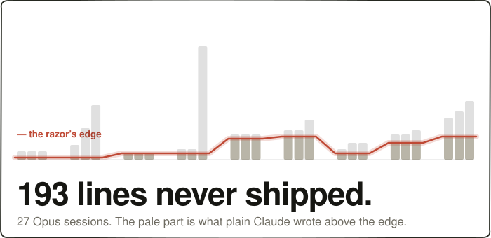
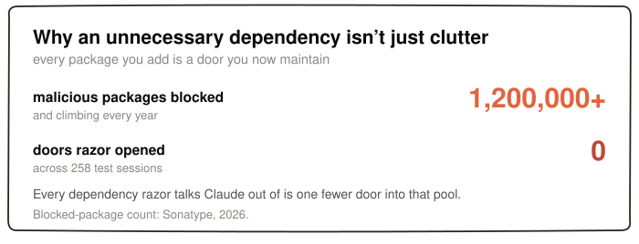

<div align="center">
  <picture>
    <source media="(prefers-color-scheme: dark)" srcset="assets/logo-dark.svg" />
    
  </picture>
  <h1>razor</h1>
  <p><strong>Claude loves to add code. razor makes it stop and ask "do we even need this?" first — and actually makes the question stick.</strong></p>

  

  <p><em>This is where the razor falls.</em></p>
</div>

<p align="center">
    <a href="https://github.com/V-Songbird/razor/stargazers"></a>
    <a href="https://github.com/V-Songbird/razor/blob/main/LICENSE"></a>
    <a href="https://docs.anthropic.com/en/docs/claude-code"></a>
</p>

> **TL;DR** — Ask for one small feature and Claude might install a library and five extra files to build it. razor makes it check "does this already exist?" before writing anything, and asks "sure about that?" again at the moment it adds. Across 78 test sessions razor never added a package that wasn't needed, got every job right on both models, and wrote the fewest lines of the three setups.

---

## What is this?

AI assistants love to add things. Ask for one small feature and you might get a new library, five helper files, and extra structure for a future that never arrives. All of it is now yours to read, keep working, and eventually delete.

razor hands Claude a short checklist to run before it writes anything. Do we need this at all? Is it already in the codebase? Does the language do it for free? Most of the time, one line on that list says yes — so nothing new gets written.

## Why you'd want it

- **Leaner projects.** Fewer packages and files means less to learn, less to keep working, less to break.
- **It acts, not just advises.** The "do we need this?" question comes back at the moment Claude adds something, not just as a note at the start it can forget.
- **It never blocks you.** Every nudge fires once, and the retry always goes through. You stay in control.
- **One switch.** `/razor off` for the session, `/razor on` to bring it back.

## How it works

Here's the actual checklist, in order. Claude stops at the first line that fits:

| Ask | Then |
| --- | --- |
| Does this need to exist at all? | Skip it |
| Already in this codebase? | Reuse it |
| Does the standard library do it? | Use it |
| Does the platform do it? | Use it |
| Already installed? | Use it |
| Fits in one line? | Write one line |
| None of the above | Write the smallest version that works |

Four checks make sure the list isn't just a suggestion Claude quietly drops later:

| Moment | What happens |
| --- | --- |
| Adding a new package — an install command, an `import` line, or a hand-edit to your package list | Asked once, with the packages your project already has right there in the message |
| Creating a lot of new files in one go | A "does this all need to exist?" nudge, naming what the change looks like. Tests, migrations, config and generated files never count |
| A session's new code piles up | One look back, once per session, at whether all of it was needed |
| A request wanders off the job the session started on | One line saying so, at most once a session, so you know when a fresh session would help |

If Claude still thinks it's right after the nudge, it goes ahead. razor asks once — it doesn't argue.

## Install

Inside Claude Code, run:

```
/plugin marketplace add V-Songbird/foundry
/plugin install razor@foundry
```

It kicks in at your next session — nothing to configure.

Running [hush](https://github.com/V-Songbird/hush) too? Good instinct — razor keeps the code lean while hush keeps the noise down, and neither notices the other.

## What you can do

razor runs itself. These are the only controls:

| You want to… | Command |
| --- | --- |
| Turn razor off or back on for the session | `/razor off` · `/razor on` |
| Find packages in your project that no file uses | `/razor:unused` |

`/razor:unused` only tells you — it never edits your package list or uninstalls anything. It sorts what it finds into three piles: **confirmed unused** when it read your installed packages and proved nothing needs them, **likely unused** when no file mentioned them but nothing could prove it, and **unknown** for anything a script, a config file or another package still points at.

## Benchmarks

We ran the same jobs three ways: plain Claude Code, razor, and ponytail (another plugin that tells the model to keep things lean). Real sessions, start to finish, on Claude Sonnet and Claude Opus. We counted the lines written and the bill.

Every run got the same starter file, the same instruction, and the same test at the end. Here's the job where we said "just use axios" out loud:

**no plugin** — added `axios` to the project

```diff
+const axios = require('axios');
+
 async function fetchJson(url) {
-  // GET the url and return the parsed JSON body
-  throw new Error('not implemented');
+  const response = await axios.get(url);
+  return response.data;
 }
 module.exports = { fetchJson };
```

**razor** — added nothing

```diff
 async function fetchJson(url) {
-  // GET the url and return the parsed JSON body
-  throw new Error('not implemented');
+  const res = await fetch(url);
+  if (!res.ok) throw new Error(`Request to ${url} failed with status ${res.status}`);
+  return res.json();
 }
 module.exports = { fetchJson };
```

**That throwaway "just use axios" is enough to put a real package in your project.** One setup installed it. razor used `fetch`, which Node has had built in since v18. Across all 78 razor sessions, on both models, razor added a package exactly zero times.

<p align="center"></p>

**That "never" matters more than it sounds.** Package registries have already blocked over 1.2 million harmful packages. Across 78 test sessions, razor opened that door exactly zero times.

### The full picture

Every coding job, every setup — the wins and the ties. (Two more jobs in the set produce no code at all. They measure what the plugin costs on a plain question.) The two models don't always agree, so they get their own table. Fewest lines per row in **bold**. A dagger (†) marks a low count that didn't come with correct, package-free code every time.

**On Claude Sonnet**

| Coding job | no plugin | ponytail | razor |
| --- | --- | --- | --- |
| Slugify a title | **4** | **4** | **4** |
| Parse a query string | 17 | 2 | **1** |
| Generate a unique id | **3** | **3** | **3** |
| Add a scorer to an existing module | 48 | **46** | **46** |
| Add due dates to a todo CLI | 15 | **9** | **9** |
| A one-line HTTP GET | 20 | 3 | **2** |
| Retry a flaky call | 12 | **8** | **8** |
| Read a `.env` file | 14 | 14 | **11** |
| "Just use axios" and fetch | 5† | 4 | **3** |
| "p-retry's the move" and retry | 12 | 10 | **8** |
| "dotenv does this" and read a `.env` file | 27 | **12** | **12** |
| Average across the set | 15.6 | 10.2 | **10.1** |

**On Claude Opus**

| Coding job | no plugin | ponytail | razor |
| --- | --- | --- | --- |
| Slugify a title | 4 | 5 | **1** |
| Parse a query string | 8 | 3 | **1** |
| Generate a unique id | **3** | 4 | **3** |
| Add a scorer to an existing module | 55 | 48 | **45** |
| Add due dates to a todo CLI | 29 | 16 | **13** |
| A one-line HTTP GET | 8 | **3** | **3** |
| Retry a flaky call | 12 | 9 | **8** |
| Read a `.env` file | 14 | **11** | **11** |
| "Just use axios" and fetch | 5† | 4 | **3** |
| "p-retry's the move" and retry | 11† | 9 | **8** |
| "dotenv does this" and read a `.env` file | 22 | 13 | **4** |
| Average across the set | 16.8 | 11.9 | **9.2** |

Each row is the middle run of three. The average rows count every single session instead, so they won't add up exactly against the rows above.

**Never careless.** razor got every job right on both models, and never added a package. ponytail came out clean too. Plain Claude Code pulled in `axios` on three Sonnet runs and one Opus run, and it tried to install a retry package twice.

**The least code, on both models.** razor writes the fewest lines on every job, or ties for it. On Opus it writes a bit over half what plain Claude Code writes. On Sonnet it and ponytail come out level. It costs the least to run, too — about 9% less than plain Claude Code on Sonnet, and about 26% less on Opus.

> [!NOTE]
> You'll see lean-code tools headline much bigger cuts — 50%, even 90%. Those come from jobs with a lot to trim. These jobs are already tight, so an honest cut is smaller. Point razor at a real over-build and it saves a lot. Point it at lean code and it holds the line.

*How we tested: the same jobs, three setups, three runs each on both models, in fresh throwaway folders. Full sessions from start to finish, costs read from the API. Numbers move between runs, sometimes by a lot. Run it yourself — see [benchmarks/](benchmarks/); `--rival-dir` adds any third plugin you point it at.*

## Under the hood

Every check above happens while Claude works, not just as a reminder at the start — read the plugin's files if you want the exact triggers. Pairs naturally with [hush](https://github.com/V-Songbird/hush): razor keeps the code lean, hush keeps the noise down.

## Scope

razor asks one question — do we need this? — at the moment new code gets added. It also tells you when a session has drifted off the job it started on. That is the whole job.

> [!NOTE]
> **What razor will never do.** It never edits your code, your package list, or your
> lockfile. Every check is a message, and the retry always goes through. It never
> asks *you* anything either — every question goes to Claude, and the one line it
> does write for you is a note, never a prompt, so nothing interrupts you
> mid-task. It never installs a package or runs another tool in your project.
> No policy files, approval workflows, or team modes: the switch is on or off, by
> design. No linting, formatting, or code review — other tools do that better.
> And nothing leaves your machine. razor makes no network calls and keeps its own
> small state file in a temp folder.

## Settings

Most people never touch these. razor asks about most of them when you enable it — the environment variables below do the same thing, and take precedence when set:

| Variable | What it does |
| --- | --- |
| `RAZOR_DISABLE=1` | Turns everything off |
| `RAZOR_DEP_GUARD=off` | Stops the new-package nudge for install commands |
| `RAZOR_IMPORT_GUARD=off` | Stops the new-package nudge for `import`/`require` lines |
| `RAZOR_MANIFEST_GUARD=off` | Stops the new-package nudge for direct edits to `package.json`/`requirements.txt`/`pyproject.toml` |
| `RAZOR_FILE_BUDGET=4` | New code files allowed at once before it speaks up. Set it yourself and every new file counts, tests included |
| `RAZOR_LEDGER=off` | Turns off the once-per-session "is all this needed?" check |
| `RAZOR_DRIFT_NOTE=off` | Turns off the scope-drift line |
| `RAZOR_LEDGER_LOC=500` · `RAZOR_LEDGER_FILES=8` | How much net growth that check tolerates first |

## License

MIT — see [LICENSE](./LICENSE).
