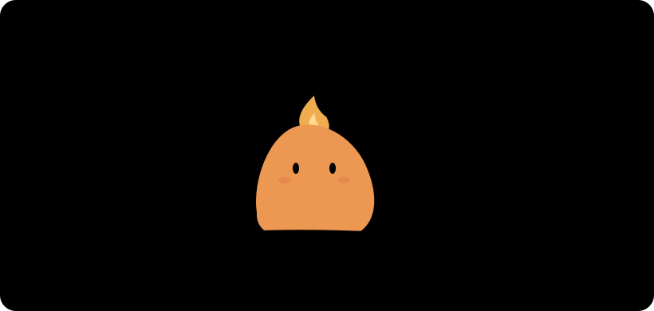

<!-- foundry:edition Codex -->
<div align="center">
  <picture>
    <source media="(prefers-color-scheme: dark)" srcset="assets/logo-dark.svg" />
    
  </picture>
  <h1>razor</h1>
  <p><strong>Before adding code, ask whether the project already has what it needs.</strong></p>
</div>

<!-- foundry:platform identity -->
**Edition: Codex.** Use this edition’s installation and compatibility notes below.
<!-- /foundry:platform identity -->

[**Install**](#install) · [What is this?](#what-is-this) · [What you can do](#what-you-can-do) · [The numbers](#the-numbers) · [Going deeper](#going-deeper)

> **TL;DR** — Before adding code, ask whether the project already has what it needs.

<p align="center"></p>

## What is this?

AI assistants love to add things. One small feature can turn into a new library, helper files and abstractions that are now yours to maintain. razor adds a short checklist and targeted checks so existing code and language features get considered first.

## Why you'd want it

- Reuse what the project already has.
- Reconsider unnecessary dependencies before installing them.
- Notice file growth before a small task becomes a larger project.
- Find declared dependencies that no source file appears to use.

## How it works

A checklist asks whether the work is needed, already implemented or covered by the language. Targeted checks can request one reconsideration. A retry follows the host’s normal permissions. The unused-dependency audit reports findings without uninstalling anything.

## Install

<!-- foundry:platform install -->
Requirements: Node.js 22 or later, Git and a Codex host with plugin support.

```text
codex plugin marketplace add V-Songbird/foundry
codex plugin add razor@foundry
```

Review and enable its hooks, then start a new Codex session.
<!-- /foundry:platform install -->

## What you can do

| You want to | Outcome |
| --- | --- |
| Keep a small task small | Check reuse, dependencies and file growth |
| Pause or resume the checks | Change the session toggle |
| Find unused dependencies | Receive a report with confirmed, likely and unknown findings |

<!-- foundry:platform commands -->
Use `razor off` / `razor on` for the session toggle and select the installed `unused` skill for a dependency report.
<!-- /foundry:platform commands -->

## The numbers

Each result belongs to the named model and recorded run. Missing measurements remain marked as unmeasured.

<!-- foundry:platform benchmarks -->
<!-- foundry:evidence {"platform":"Codex","status":"measured","models":["GPT-5.6 Sol"],"source":"docs/razor/validation/codex-benchmark-source-2026-09-08.md","date":"2026-09-08"} -->
| Model | Setup | Correct and safe | Mean coding lines |
| --- | --- | --- | --- |
| GPT-5.6 Sol | No plugin | 19/26 | 19.2 |
| GPT-5.6 Sol | razor | 26/26 | 9.6 |

Controlled Codex run at high reasoning on Windows: the table covers the full task group. Across all groups, razor passed 38/38 cases versus 29/38 without it. On jointly passing pairs, elapsed time was 1.8% higher and input tokens 0.8% higher; those measures did not improve. This exploratory result does not compare Sol against Claude.
<!-- /foundry:platform benchmarks -->

*Results can vary between runs.*

## Going deeper

<!-- foundry:platform links -->
[How it works](docs/HOW-IT-WORKS.md) · [Settings](docs/SETTINGS.md) · [Codex setup](docs/SETUP.md) · [Native benchmark harness](https://github.com/V-Songbird/foundry/blob/main/benchmarks/razor/CODEX-HARNESS.md)
<!-- /foundry:platform links -->

[Foundry](https://github.com/V-Songbird/foundry) holds the research, methodology and detailed evidence for this plugin.

## Good to know

Input validation, security and error handling that protects your work remain necessary. Explicitly requested scope stays yours to choose. These checks are advisory, not a security boundary.

<!-- foundry:platform compatibility -->
Native patch checks cover previewable `apply_patch` changes. Shell writes and unsupported or ambiguous patches can bypass those checks. See [setup and coverage](docs/SETUP.md).
<!-- /foundry:platform compatibility -->

## License

MIT — see [LICENSE](LICENSE).
